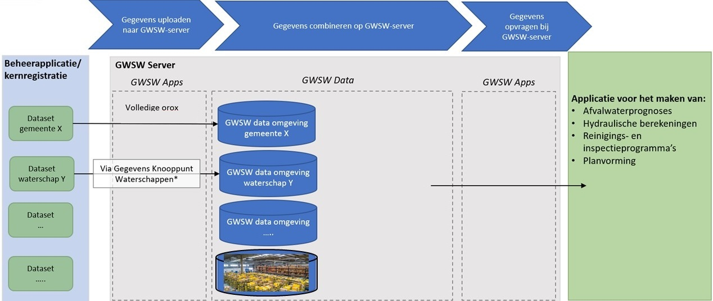
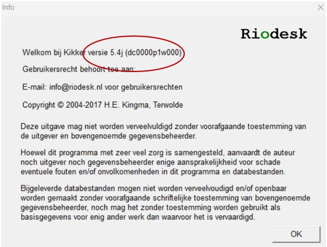

# Gebruik van het GWSW
In het Gegevenswoordenboek Stedelijk Water (GWSW) worden alle objecten en gegevens van objecten, hun onderlinge relaties, en de beheeractiviteiten aan de riolering eenduidig gedefinieerd en vastgelegd ten behoeve van een soepele gegevensuitwisseling en beter beheer.

## Aanleiding

Dit hoofdstuk is in het leven geroepen om riooldatabeheerders te ondersteunen in het gebruik van het GegevensWoordenboek Stedelijk Water (GWSW) door middels van een laagdrempelig stappenplan. Het GWSW komt ingewikkeld over en is dat ook op sommige vlakken. Als je echter onder de moterkap van een auto kijkt, dan komt dat ook ingewikkeld over. Het is echter niet nodig om precies te begrijpen hoe een auto helemaal werkt, om toch goed en veilig de auto te kunnen besturen. Zo werkt het ook met het GWSW.

De inhoudsopgave aan de linkerkant van de website kan gebruikt worden als leeswijzer en voor navigatie over de pagina.

Op de site van Stichting RIONED staat de ['waarom'](https://www.riool.net/applicaties/gegevenswoordenboek-stedelijk-water/waarom-gwsw-) beschreven. In de volgende alinea staat de 'hoe' van het GWSW toegelicht. De rest van de website richt zich op de 'wat' van het GWSW: Op welke manier kan een riooldatabeheerder het GWSW in haar of zijn dagelijke praktijk (op operationeel niveau) gebruiken. Dit proberen we te doen aan de hand van instructies per rioolobject te geven in de vorm van filmpjes, figuren of teksten. Hiervoor is de samenwerking met de onderstaande leveranciers van beheersoftware gezocht:

*Logo's van meewerkende leveranciers worden hier ingevoegd*

## Hoe werkt het GWSW? 
Het GegevensWoordenboek Stedelijk Water is niets meer dan gezamenlijke afspraken over de taal (ontologie), de verbanden (datamodel) en de uitwisseling van gegevens die iets te maken hebben met het domein stedelijk water. Dit heeft Stichting RIONED onderverdeeld in *Gegevens* en *Toepassingen*.

De *Gegevens* staan op [data.gwsw.nl](https://data.gwsw.nl/) en bestaan uit:
- Woordenboek: Hoe noemen we 'iets'?
- Datamodel: Hoe zijn de verbanden of relaties tussen die 'iets-en'?
- Opslag: De daadwerkelijke gegevens worden per organisatie conform het datamodel opgeslagen op de GWSW-server.

Denk bij de *Gegevens* aan een  logistiek distributiecentrum van een bedrijf zoals Bol.com. Een hal met logische en (daardoor) efficiënte opslag van spullen. Een stelling met 'wasmachines' en een stelling met 'drogers' in een hoek van de hal waar ook de rest van het witgoed staat is ook een vorm van een datamodel. 

De *Toepassingen* staan op [apps.gwsw.nl](https://apps.gwsw.nl/) en bestaan uit functionaliteiten voor het importeren, controleren en exporteren van de gegevens uit het 'distributiecentrum van het GWSW' (Figuur 1). Vanuit het beheerpakket van de gemeente wordt een uitwisselformaat geexporteerd. Deze kan via de import (upload) functionaliteit op  [apps.gwsw.nl](https://apps.gwsw.nl/) in de dataset op de GWSW-server worden gezet. Op de GWSW-server kunnen de gegevens worden gecontroleerd met behulp van (de functionaliteit van) de nulmeting. Ook kunnen de gegevens worden opgevraagd of worden geëxporteerd vanaf de GWSW-server.

*Figuur 1 - Importeren, controleren en exporteren van gegevens op de GWSW-server* 

Verder is het goed te beseffen dat het GWSW in ontwikkeling is, voor zowel de ontologie, het datamodel en de uitwisseling). De huidige versie is 1.6 waarmee ook informatie voor hydraulische berekeningen en het opstellen van afvalwaterprognoses kan worden uitgewisseld. De adoptie van het GWSW is een groeipad voor Stichting RIONED, de leveranciers van beheer- en rekenpakketten en de gebruikers. Welke gevolgen dit heeft voor het gebruik, staat vermeld onder het kopje [Randvoorwaarden](#randvoorwaarden).

# Randvoorwaarden

Om het gegevensbeheer, -uitwisseling en -gebruik goed aan te laten sluiten op het GWSW zijn er een aantal randvoorwaarden (met verantwoordelijkheid) van toepassing. 
1) Het beheerpakket moet in staat zijn om de gegevens op te slaan conform het GWSW (Leverancier beheerpakket)
2) Het beheerpakket moet gevuld zijn met gegevens die qua inhoud aansluiten op het GWSW (Riooldatabeheerder)
3) Het beheerpakket moet in staat zijn om de gegevens te exporteren conform het GWSW (Leverancier beheerpakket)
4) De GWSW-server moet in staat zijn om een correct bestand te kunnen importeren, opslaan en exporteren (Stichting RIONED)
5) Externe applicaties moeten in staat zijn om op basis van een export vanaf de GWSW-server de gegevens toe te passen (Leverancier externe applicatie)

Omdat het doel van voorliggende website is om riooldatabeheerders te ondersteunen in het gebruik van het GWSW, zijn de punten over het [beheerpakket](#beheerpakket) (punt 1 en 3) en het [gegevensbeheer](#gegevensbeheer)(punt 2) voor nu het meest relevant. Punt 4 en 5 worden elders opgepakt.

## Beheerpakket (punt 1 en 3)
Om de gegevens GWSW conform op te kunnen slaan, moet het beheerpakket beschikken over de benodigde velden die in het GWSW zijn gedefinieerd. Verder moet het beheerpakket in staat zijn de informatie uit die velden te exporteren conform het [GWSW-uitwisselbestand (orox)](https://apps.gwsw.nl/doc/GWSW.orox%20Opbouw%20dataset.pdf). Zoals eerder gezegd, is het GWSW in ontwikkeling. Er zijn dus naast de vigerende versie (1.6) ook nog eerdere versies van het GWSW. Leveranciers van beheerpakketten zijn bezig met het aansluiten op de vigerende versie van het GWSW, maar dat is technisch gezien niet altijd eenvoudig te realiseren. Daarnaast kan het zijn dat de nieuwste versie van het beheerpakket aansluit, maar dat de riooldatabeheerder nog gebruik maakt van een oudere versie van het beheerpakket. 

Voor de riooldatabeheerder is het belangrijk om in beeld te hebben:
- Welke versie van het beheerpakket heb ik?
- Welke versie van het GWSW heeft mijn beheerpakket?
- Hoe kan ik mijn beheerpakket updaten naar de nieuwste versie?

Naast de inspanningen van Stichting RIONED, zal ook de gebruiker de behoefte aan verdere implementatie van het GWSW in het beheerpakket nadrukkelijk moeten uitspreken richting de leverancier.

Hieronder staat per beheerpakket hoe je in beeld kan krijgen welke versies van toepassing zijn:
[Kikker / BRUTIS](#kikker_versie)
[Obsurv / RioGL](#riogl_versie)
[GBI](#gbi_versie)
[Gisib](#gisib_versie)
[Geovisia](#geovisia_versie)

### Kikker / BRUTIS (Riodesk)

Opvragen versie van beheerpakket: Menubalk > Info > Infovenster (Figuur 2)

*Figuur 2 - Infovenster Kikker met daarin rood omcirkeld de versie*

Op welke versie van het GWSW sluit mijn versie van het beheerpakket aan?

|Versie Kikker| Versie GWSW |
|-------------|-------------|
|5.4          |1.5          |
|5.3          |1.5          |
|4.0          |1.4          |
|3.6          |1.4          |

Neem contact op met info@riodesk.nl om informatie te ontvangen over het updaten naar de nieuwste versie van Kikker / BRUTIS.

### Obsurv / RioGL (SWECO)
pm

### GBI (Antea)
pm

### Gisib (Dg Groep)
pm

### Geovisia (Dataquint)
pm

## Gegevensbeheer (punt 2)

Gegevens kunnen enkel uitgewisseld worden, als deze (goed) in het beheerpakket staan. Bestaat een veld niet in het datamodel van het beheerpakket, dan kan deze ook niet worden ingevuld door de gebruiker. Hierover gaat [vorige paragraaf](#beheerpakket). Is een veld leeg, dan zal dit veld ook als 'leeg' worden meegenomen in de uitwisseling. Is een veld ingevuld met een 'foute' waarde (bijv. 999 wat vaak gebruikt wordt voor 'onbekend'), dan zal dit veld ook als waarde '999' worden meegenomen in de uitwisseling. Kortom de **volledigheid** en **kwaliteit** van de geregistreerde gegevens moeten voldoende zijn om het gewenste resultaat te krijgen.

Daarnaast is het vaak zo dat de stelselgegevens in het beheerpakket zitten maar dat kunstwerken op een andere manier worden geregistreerd, zoals in GIS, excelbestanden, telemetriesysteem of gemalenbeheerprogramma's. De (gegevens van) objecten die niet in het (stelsel)beheerpakket zitten, komen niet met de export uit het beheerpakket meekomen. Helaas is het zo dat die andere registraties (nog) niet zijn aangesloten op het GWSW. Dus ook vanuit die registraties kunnen de gegevens niet GWSW-conform worden uitgewisseld.

Dus wat kan jij, als riooldatabeheerder, doen om het gegevensbeheer in het beheerpakket zo doelmatig mogelijk in te richten, waarmee de gegevens aansluiten op het GWSW? Hiervoor hebben we een stappenplan, waarmee jij kan bepalen op welke manier jij te werk wil gaan:

# Stappenplan
