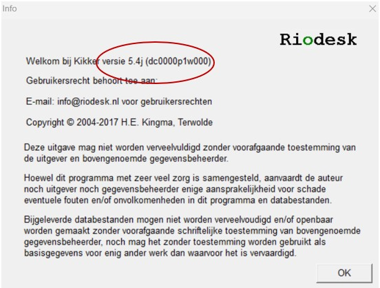

# GWSW Apps

# Inleiding

Stichting RIONED is initiatiefnemer en eigenaar van dit GitHub-project, Eric Oosterom is de verantwoordelijk projectmanager. 

Vragen over deze website en het GWSW kunt u stellen via gwsw@rioned.org. 

# Gebruik van het GWSW
In het GegevensWoordenboek Stedelijk Water (GWSW) worden alle objecten en gegevens van objecten, hun onderlinge relaties, en de beheeractiviteiten aan de riolering 
eenduidig gedefinieerd en vastgelegd ten behoeve van een soepele gegevensuitwisseling en beter beheer.

## Aanleiding

Dit hoofdstuk is in het leven geroepen om riooldatabeheerders te ondersteunen in het gebruik van het GegevensWoordenboek Stedelijk Water (GWSW) door middels van een laagdrempelig stappenplan. 
Het GWSW komt ingewikkeld over en is dat ook op sommige vlakken. Als je echter onder de moterkap van een auto kijkt, dan komt dat ook ingewikkeld over. Het is echter niet nodig om precies 
te begrijpen hoe een auto helemaal werkt, om toch goed en veilig de auto te kunnen besturen. Zo werkt het ook met het GWSW.

De inhoudsopgave aan de linkerkant van de website kan gebruikt worden als leeswijzer en voor navigatie over de pagina.

Op de site van Stichting RIONED staat de ['waarom'](https://www.riool.net/applicaties/gegevenswoordenboek-stedelijk-water/waarom-gwsw-) beschreven. 
In de volgende alinea staat de 'hoe' van het GWSW toegelicht. De rest van de website richt zich op de 'wat' van het GWSW: Op welke manier kan een riooldatabeheerder het GWSW in haar of 
zijn dagelijke praktijk (op operationeel niveau) gebruiken. Dit proberen we te doen aan de hand van instructies per rioolobject te geven in de vorm van filmpjes, figuren of teksten. 
Hiervoor is de samenwerking met de onderstaande leveranciers van beheersoftware gezocht:

*Logo's van meewerkende leveranciers worden hier ingevoegd*

## Hoe werkt het GWSW? 
Het GegevensWoordenboek Stedelijk Water is niets meer dan gezamenlijke afspraken over de taal (ontologie), de verbanden (datamodel) en de uitwisseling van gegevens die iets te maken hebben 
met het domein stedelijk water. Dit heeft Stichting RIONED onderverdeeld in *Gegevens* en *Toepassingen*.

De *Gegevens* staan op [data.gwsw.nl](https://data.gwsw.nl/) en bestaan uit:
- Woordenboek: Hoe noemen we 'iets'?
- Datamodel: Hoe zijn de verbanden of relaties tussen die 'iets-en'?
- Opslag: De daadwerkelijke gegevens worden per organisatie conform het datamodel opgeslagen op de GWSW-server.

Denk bij de *Gegevens* aan een  logistiek distributiecentrum van een bedrijf zoals Bol.com. Een hal met logische en (daardoor) efficiënte opslag van spullen. 
Een stelling met 'wasmachines' en een stelling met 'drogers' in een hoek van de hal waar ook de rest van het witgoed staat is ook een vorm van een datamodel. 

De *Toepassingen* staan op [apps.gwsw.nl](https://apps.gwsw.nl/) en bestaan uit functionaliteiten voor het importeren, controleren en exporteren van de gegevens 
uit het 'distributiecentrum van het GWSW' (Figuur 1). Vanuit het beheerpakket van de gemeente wordt een uitwisselformaat geexporteerd. Deze kan via de import (upload) 
functionaliteit op  [apps.gwsw.nl](https://apps.gwsw.nl/) in de dataset op de GWSW-server worden gezet. Op de GWSW-server kunnen de gegevens worden gecontroleerd met 
behulp van (de functionaliteit van) de nulmeting. Ook kunnen de gegevens worden opgevraagd of worden geëxporteerd vanaf de GWSW-server.

*Figuur 1 - Importeren, controleren en exporteren van gegevens op de GWSW-server* 

Verder is het goed te beseffen dat het GWSW in ontwikkeling is, voor zowel de ontologie, het datamodel en de uitwisseling). 
De huidige versie is 1.6 waarmee ook informatie voor hydraulische berekeningen en het opstellen van afvalwaterprognoses kan worden uitgewisseld. 
De adoptie van het GWSW is een groeipad voor Stichting RIONED, de leveranciers van beheer- en rekenpakketten en de gebruikers. 
Welke gevolgen dit heeft voor het gebruik, staat vermeld onder het kopje [Randvoorwaarden](#randvoorwaarden).

## Randvoorwaarden

Om het gegevensbeheer, -uitwisseling en -gebruik goed aan te laten sluiten op het GWSW zijn er een aantal randvoorwaarden (met verantwoordelijkheid) van toepassing. 
1) Het beheerpakket moet in staat zijn om de gegevens op te slaan conform het GWSW (Leverancier beheerpakket)
2) Het beheerpakket moet gevuld zijn met gegevens die qua inhoud aansluiten op het GWSW (Riooldatabeheerder)
3) Het beheerpakket moet in staat zijn om de gegevens te exporteren conform het GWSW (Leverancier beheerpakket)
4) De GWSW-server moet in staat zijn om een correct bestand te kunnen importeren, opslaan en exporteren (Stichting RIONED)
5) Externe applicaties moeten in staat zijn om op basis van een export vanaf de GWSW-server de gegevens toe te passen (Leverancier externe applicatie)

Omdat het doel van voorliggende website is om riooldatabeheerders te ondersteunen in het gebruik van het GWSW, zijn de punten over het [beheerpakket](#beheerpakket) (punt 1 en 3) 
en het [gegevensbeheer](#gegevensbeheer)(punt 2) voor nu het meest relevant. Punt 4 en 5 worden elders opgepakt.

### Beheerpakket
(punt 1 en 3)
Om de gegevens GWSW conform op te kunnen slaan, moet het beheerpakket beschikken over de benodigde velden die in het GWSW zijn gedefinieerd. Verder moet het beheerpakket in staat 
zijn de informatie uit die velden te exporteren conform het [GWSW-uitwisselbestand (orox)](https://apps.gwsw.nl/doc/GWSW.orox%20Opbouw%20dataset.pdf). Zoals eerder gezegd, 
is het GWSW in ontwikkeling. Er zijn dus naast de vigerende versie (1.6) ook nog eerdere versies van het GWSW. Leveranciers van beheerpakketten zijn bezig met het aansluiten 
op de vigerende versie van het GWSW, maar dat is technisch gezien niet altijd eenvoudig te realiseren. Daarnaast kan het zijn dat de nieuwste versie van het beheerpakket aansluit, 
maar dat de riooldatabeheerder nog gebruik maakt van een oudere versie van het beheerpakket. 

Voor de riooldatabeheerder is het belangrijk om in beeld te hebben:
- Welke versie van het beheerpakket heb ik?
- Welke versie van het GWSW heeft mijn beheerpakket?
- Hoe kan ik mijn beheerpakket updaten naar de nieuwste versie?

Naast de inspanningen van Stichting RIONED, zal ook de gebruiker de behoefte aan verdere implementatie van het GWSW in het beheerpakket nadrukkelijk moeten uitspreken richting de leverancier.

Hieronder staat per beheerpakket hoe je in beeld kan krijgen welke versies van toepassing zijn:
[Kikker / BRUTIS](#kikker_versie)
[Obsurv / RioGL](#riogl_versie)
[GBI](#gbi_versie)
[Gisib](#gisib_versie)
[Geovisia](#geovisia_versie)

#### Kikker / BRUTIS (Riodesk)

Opvragen versie van beheerpakket: Menubalk > Info > Infovenster (Figuur 2)

*Figuur 2 - Infovenster Kikker met daarin rood omcirkeld de versie*

Op welke versie van het GWSW sluit mijn versie van het beheerpakket aan?

| Versie Kikker | Versie GWSW |
|---------------|-------------|
| 5.4           | 1.5         |
| 5.3           | 1.5         |
| 4.0           | 1.4         |
| 3.6           | 1.4         |

Neem contact op met info@riodesk.nl om informatie te ontvangen over het updaten naar de nieuwste versie van Kikker / BRUTIS.

#### Obsurv / RioGL (SWECO)
pm

#### GBI (Antea)
pm

#### Gisib (Dg Groep)
pm

#### Geovisia (Dataquint)
pm

### Gegevensbeheer 
(punt 2)

Gegevens kunnen enkel uitgewisseld worden, als deze (goed) in het beheerpakket staan. Bestaat een veld niet in het datamodel van het beheerpakket, 
dan kan deze ook niet worden ingevuld door de gebruiker. Hierover gaat [vorige paragraaf](#beheerpakket). Is een veld leeg, dan zal dit veld ook als 'leeg' worden meegenomen in de uitwisseling. Is een veld ingevuld met een 'foute' waarde (bijv. 999 wat vaak gebruikt wordt voor 'onbekend'), dan zal dit veld ook als waarde '999' worden meegenomen in de uitwisseling. Kortom de **volledigheid** en **kwaliteit** van de geregistreerde gegevens moeten voldoende zijn om het gewenste resultaat te krijgen.

Daarnaast is het vaak zo dat de stelselgegevens in het beheerpakket zitten maar dat kunstwerken op een andere manier worden geregistreerd, zoals in GIS, excelbestanden, 
telemetriesysteem of gemalenbeheerprogramma's. De (gegevens van) objecten die niet in het (stelsel)beheerpakket zitten, komen niet met de export uit het beheerpakket meekomen. Helaas is het zo dat die andere registraties (nog) niet zijn aangesloten op het GWSW. Dus ook vanuit die registraties kunnen de gegevens niet GWSW-conform worden uitgewisseld.

Dus wat kan jij, als riooldatabeheerder, doen om het gegevensbeheer in het beheerpakket zo doelmatig mogelijk in te richten, waarmee de gegevens aansluiten op het GWSW? 
Hiervoor hebben we een stappenplan, waarmee jij kan bepalen op welke manier jij te werk wil gaan:

# Details GWSW Apps

## Aandachtspunten export OroX-bestand

Deze analyse is gebaseerd op:
* de verslaggeving van Diet van Wendel (mailing dd najaar 2017) 
* de verslaggeving van Gwendolijn Vugs (notitie dd 20180124, kenmerk N002-1260650GBV-V01-hgm-NL)
* de meldingen van de GWSW Adviseurs (vanaf februari 2018 tot heden)

### Tips voor leveranciers:

* De hoofdriolering en aansluitingen zo veel mogelijk scheiden, ook de erfafscheidingsputten in dataset_Aansluitingen zetten (het netwerk = hoofdriolering) (20240226/mv).
* In het OroX-bestand de gestapelde kenmerken "unblanken" (geef ze een URI). Dan wordt SHACL rapport beter bruikbaar, de focusNode is herleidbaar (20240226/mv).
* In het OroX-bestand bij relining de begindatum-lining meegeven, niet de begindatum-leiding aanpassen (20240226/mv).
* In het OroX-bestand ook bij putten (niet alleen bij leidingen) het stelsel benoemen (gwsw:isPartOf) (case Heusden, Almere, ...) (20240209/mv).
* Verduidelijk de handelingen voor de exportfunctie van GWSW.orox zodat de juiste omzetting van alle gegevens uit de native-database geborgd is.
* Geef in een logbestand op heldere wijze aan welke gegevens zijn omgezet en welke aannames daarbij zijn gedaan. Anders blijven ook automatische "verbeteringen" verborgen.
* Beperk de native database gaandeweg steeds meer conform de GWSW ontologie, begin bijvoorbeeld met voorgeschreven stelseltypes, puttypes, leidingtypes.
- Hulppunt als puttype op termijn verwijderen (Obsurv)
- Randvoorziening specificeren naar bijvoorbeeld Lamellenfilter, Retentievoorziening (Obsurv)
- MechanischRioolstelsel, VrijvervalRioolleiding en Deksel specificeren naar bijvoorbeeld Drukriolering enzovoort. (Kikker)
* Neem ontbrekende kenmerken niet mee in het GWSW.orox bestand, ook niet zonder inhoud. De relatie gwsw:hasAspect niet opnemen. (Kikker)
* Neem puttypes zonder onderscheidende functie op als extra typering (maak ze "multiparent"). Bijvoorbeeld een blinde put is zowel een type gwsw:Inspectieput als gwsw:BlindePut. 
Idem voor bijvoorbeeld verdekte put. (Obsurv, Kikker)
* Typeer onbekende objectsoorten altijd zo globaal mogelijk, bijvoorbeeld puttype "onbekend" omzetten naar gwsw:Rioolput ipv gwsw:Inspectieput. Dan signaleert de nulmeting het 
onbekende (te globale) type.
* Neem uitgevoerde maatregelen zoals gwsw:VisueelInspecterenVrijvervalLeiding correct mee in de orox-export. De maatregel heeft de relatie gwsw:hasInput met het object, 
zie de beschrijving van GWSW.orox. (Kikker: "gwsw:hasInput" ontbreekt, alle maatregelen zijn "inspectie") (Obsurv: maatregelen ontbreken nog) (melding Leendert, 20180702)
* Verwijder de spatie uit het top-concept "Stedelijk gebied" in GWSW.orox versie 1.4, wordt StedelijkGebied. Nog mooier is Rioleringsgebied, 
heeft dan als deel één óf meer Rioolstelsels. (Kikker, diverse cases, meldingen in sep 2018)
* Prefixes in GWSW.orox versie 1.4, gebruik gwsw: voor gwsw-concepten, gebruik : (blank) voor gemeente-concepten (Kikker, diverse cases, meldingen in sep 2018) 
* Lining komt niet mee in .orox bestand (Kikker, case Haarlemmermeer, melding Rob, 20180910). Lining kan met de relatie "hasPart" aan de leiding worden gekoppeld.
* Ook grote GML-linestring records (met veel punten) toestaan, breekt nu af op 24000 karakters (Kikker, case HHNK_Persleidingen, 20180911)
* Denk aan notatie van quotes in een string-literal, "Naam "met quotes" " kan niet, "Naam \\"met quotes\\" " kan wel (Kikker, case HHNK_Persleidingen, 20180911).

### Tips voor gegevensbeheerders/adviseurs:
* Hanteer, indien het beheersysteem dit al niet verplicht stelt, alleen de GWSW objecttypes. Vooral belangrijk voor de soorten Stelsel, Put en Leiding.
* Toets de vulling van de kenmerken aan de voorwaarden van de conformiteitsklassen (verplichte vulling, grenswaarden)
* Vermijd typeringen zoals "onbekend", vul aan op basis van revisies of inspecties (Kikker)
* Vermijd typeringen zoals "hulppunt", specificeer naar bijvoorbeeld t-stuk, ontstoppingsstuk (Obsurv)
* Stem af met de leveranciers hoe speciale constructie conform GWSW beschreven dienen te worden (bijvoorbeeld "doorlaat" in Obsurv (case Zwolle) of 
"spindelschuif" in Kikker (melding Jafeth, 20180713)

## Aandachtspunten upload OroX-bestand

Deze analyse is gebaseerd op:
* de verslaggeving van Diet van Wendel (mailing dd najaar 2017) 
* de verslaggeving van Gwendolijn Vugs (notitie dd 20180124, kenmerk N002-1260650GBV-V01-hgm-NL)
* de meldingen van de GWSW Adviseurs (vanaf februari 2018 tot heden)

### Geconstateerd tijdens upload GWSW.orox

Tip: de foutmeldingen en het vermelde regelnummer ("[line nnn]") zijn niet altijd traceerbaar in het .orox-bestand. Parse het bestand met het beheersysteem voor een aanvullende analyse.

Response: "RDF Parse Error: IRI included an unencoded space: '32' [line 13]" (20171031)
_Oorzaak: bug in Obsurv versie 2.0. In IRI bestandsnaam (metagegevens) kan geen spatie voorkomen. (regelnummer van de melding kan dus iets afwijken van 
die in het .orox bestand)_

Response: "RDF Parse Error: Expected ':', found '\r' [line nnnn]" (20171031)
_Oorzaak: bug in Obsurv versie 2.0. In IRI gwsw-concept ":Buiten gebruik"staan spaties. Concept-IRI moet zijn :LozeLeiding._

Response: "RDF Parse Error: Illegal predicate value: \"xxx\"^^ [line nnn]" (20171031)
_Oorzaak: bug in Kikker. In IRI bim-concept Stelsel staan spaties._

Response: "RDF Parse Error: Unexpected end of file" (20171101)
_Oorzaak: mogelijke bug in Obsurv, laatste regel is geen afgeronde triple._

Response GWSW Server: "fout bij decoding … geen utf-8 ?" (20171101)
_Oorzaak: mogelijke bug in Kikker. GWSW Server is gevoelig voor bestandsformaat, moet UTF-8 zijn (zonder BOM / Signature). Dat geldt ook wanneer er een 
enkel niet-UTF-8-karakter voorkomt. Dan het bestand expliciet opnieuw opslaan in UTF-8 (lukt nog niet met Notepad++, wel met Visual Studio)._

Upload geslaagd, alleen geen putten en leidingen zichtbaar (20180906, Haarlemmermeer)
_Oorzaak: In de Kikker-export conform GWSW-OroX versie 1.4 waren de prefixes voor GWSW-concepten en Gemeente-objecten juist gedefinieerd, maar omgedraaid 
toegepast in het GWSW.orox bestand._

## Evaluatie Nulmeting

De juiste interpretatie van de nulmeting-resultaten vraagt kennis van het gehele proces. De GWSW Nulmeting dient alleen door daarin getrainde adviseurs uitgevoerd te worden. 
Algemene informatie over de GWSW Nulmeting is te vinden in:
* Het document GWSW Nulmeting Beschrijving (download op [apps.gwsw.nl](https://apps.gwsw.nl) )

### Procedure meting gegevenskwaliteit
* Vul de GWSW Dataset: upload een GWSW.orox export
* Start de nulmeting: toets de dataset aan de gekozen conformiteitsklasse, bijvoorbeeld "MdsPlan" 
* Voer de nulmeting uit en analyseer de resultaten
* Doe eerst een "quick-scan". Als er veel onbekende of te globale typeringen zijn, is de overige kwaliteitsmeting niet betrouwbaar. Breng dan eerst de database voor wat betreft 
de typering op orde. Daarmee voorkom je dat er twee keer een “zwaar” metingtraject wordt doorlopen. (ervaring met case Tholen)
* Gebruik de GWSW-Geoserver (via het WFS protocol) om de grafische presentatie te vergelijken met die van het Beheersysteem
* Voer de nulmeting opnieuw uit en herleid de foutmeldingen:
	- Oorzaak in native database? (dus beheersysteem nodig bij de analyse) = melden bij beheerder
	- Oorzaak in de exportfunctie Orox ? (opbouw/mapping GWSW.orox bestand onvoldoende)  = melden bij softwareleverancier (altijd via RIONED)
	- Oorzaak in de nulmeting (foute werking) = melden bij RIONED
	- Oorzaak in de ontologie (GWSW algemeen of de CFK, bijvoorbeeld: bepaalde types ontbreken nog) = melden bij RIONED

### Eerdere analyse van de werking
(oktober 2017 - januari 2018)

**Inrichting conformiteitsklassen**
Op de websites de kwaliteit van de conformiteitsklassen (bijvoorbeeld [MdsPlan](https://apps.gwsw.nl/MdsPlan)) controleren:
* Zijn alle soorten vermeld?
	- Zijn ze niet te globaal?
	- Zijn ze niet te gedetailleerd?
* Zijn alle kenmerken vermeld?
	- Zijn ze terecht verplicht? ("exact = 1")
	- Zijn ze terecht optioneel?

**Document GWSW Nulmeting Beschrijving controleren:**
* Is het leesbaar voor buitenstaanders?
* Is het volledig?
	
**De rapportage van de nulmetingen (vooralsnog in platte csv-vorm) controleren:**
* Is het leesbaar voor buitenstaanders?
* Staat er voldoende informatie in om conclusies te kunnen trekken?
* Welke vervolgrapportage (met die conclusies) moet er komen?

# Gegevensgebruiksniveaus

Gegevensgebruiksniveau's zijn bedoeld als handvat voor beheerders en applicatieleveranciers.
Een gegevensgebruiksniveau bevat de definitie van de gewenste gegevensopbouw in relatie tot een bepaalde toepassing.  
Ze zijn een toetsingsmiddel voor bijvoorbeeld een beheersysteem, is de databasedefinitie en -vulling op orde?

## Ontwerp

Zie het product van de werkgroep GWSW-CFK in de [spreadsheet Typering](conformiteitsklassen/20230929%20CFK%20overzicht%20TYPERING%20-%20Marinus.xlsx) 
en de [spreadsheet Kenmerken](conformiteitsklassen/20231002%20CFK%20overzicht%20KENMERKEN%20-%20Marinus.xlsx).
Deze spreadsheets bevatten de omschrijving van vijf nieuwe gegevensgebruiksniveau's.  

In de spreadsheets is per fysiek object en gebruiksniveau een markering opgenomen:
* G - Het objecttype (de klasse) doet mee, valt binnen het gebruiksniveau
* N - Het objecttype is niet relevant/neutraal, valt buiten het gebruiksniveau
* F - Het objecttype valt binnen het gebruiksniveau maar is te abstract, gebruik een subtype

## Vijf gebruiksniveaus

| Niveaunaam | Omschrijving                                                        | CFK-code | Deelmodel   |
|------------|---------------------------------------------------------------------|----------|-------------|
| RIBX       | Reiniging en inspectie vrijverval riolering                         | R        | RibHeen     |
| Modelleren | Hydraulisch modelleren, berekenen                                   | H        | Hyd         |
| Prognoses  | Afvalwaterprognoses, ontwikkelingen in de afvalwaterketen           | K        | Kengetallen |
| Ligging    | Ligging en globale objectinformatie van hoofdriolering (bijv. PDOK) | M        | Mds         |
| Volledig   | Alle stedelijk water objecten                                       | B        | Basis       |

### Notatie in datamodel

De gegevensgebruiksniveau's zijn als notatie in het GWSW-datamodel opgenomen met het predikaat gwsw:hasValidity bij de klassebeschrijving, 
zie ook de [beschrijving Validity Context](https://stichtingrioned.github.io/GWSW_Ontologie_RDF/#validity-context).  

Het in de tabel genoemde deelmodel omvat minimaal de fysieke objecten van het gebruiksniveau. Met behulp van de datamodel-notaties kan binnen
het deelmodel de gebruiksniveau-definitie verder worden aangescherpt, de notatie kan markeren dat het objecttype niet relevant is of te abstract is.

## Eisenlijst

Een eisenlijst bevat voorwaarden waarmee de gegevens van fysieke objecten, in bijvoorbeeld een rioolbeheerpakket, 
getoetst kunnen worden op (de mate van) volledigheid, betrouwbaarheid en nauwkeurigheid.

Op basis van de gebruiksniveau-notaties in het GWSW-datamodel kan met GWSW Apps zo'n eisenlijst worden opgevraagd. 
De lijst wordt dan automatisch samengesteld op basis van een niveaunaam of een combinatie daarvan.  

Als de beheerder met zijn gegevens bijvoorbeeld een hydraulische doorrekening wil maken en ook een fatsoenlijke gegevenspresentatie voor PDOK wil leveren, 
dan kiest zij/hij voor de gebruiksniveau's Modelleren en Ligging.

# Conformiteitsklassen - oud

## Typering objecten
In de volgende tabel staan de kwaliteitsmaatstaven voor de typering van objecten per conformiteitsklasse. Als een kwaliteitsmaatstaf niet is ingevuld, dan komt het concept niet voor in de 
desbetreffende conformiteitsklasse.

### Legenda: Kwaliteit typering

Kwaliteitsmaatstaf | Code                                   | Omschrijving
-------------------|----------------------------------------|----------------------------------------
Fout               | <strong style="color:red">F</strong>   | Het object is onvoldoende getypeerd
Goed               | <strong style="color:green">G</strong> | De typering van het object is voldoende

### Maatstaven: Kwaliteit typering

Supertype               | Naam concept              | MdsPlan                                | MdsProj                                | Hyd
------------------------|---------------------------|----------------------------------------|----------------------------------------|---------------------------------------
Fysiek object           | Stelsel                   | <strong style="color:red">F</strong>   | <strong style="color:red">F</strong>   | <strong style="color:red">F</strong>
Stelsel                 | Rioolstelsel              | <strong style="color:red">F</strong>   | <strong style="color:red">F</strong>   | <strong style="color:red">F</strong>
Rioolstelsel            | Vrijverval rioolstelsel   | <strong style="color:red">F</strong>   | <strong style="color:red">F</strong>   | <strong style="color:red">F</strong>
Vrijverval rioolstelsel | Gemengd stelsel           | <strong style="color:green">G</strong> | <strong style="color:green">G</strong> | <strong style="color:green">G</strong>
Gemengd stelsel         | Verbeterd gemengd stelsel | <strong style="color:green">G</strong> | <strong style="color:green">G</strong> | <strong style="color:green">G</strong>
Vrijverval rioolstelsel | Hemelwaterstelsel         | <strong style="color:green">G</strong> | <strong style="color:green">G</strong> | <strong style="color:green">G</strong>
Vrijverval rioolstelsel | Vuilwaterstelsel          | <strong style="color:green">G</strong> | <strong style="color:green">G</strong> | <strong style="color:green">G</strong>
Vrijverval rioolstelsel | Onderbemaling             | <strong style="color:red">F</strong>   | <strong style="color:red">F</strong>   | <strong style="color:red">F</strong>
Rioolstelsel                 | Mechanisch rioolstelsel            | <strong style="color:red">F</strong>    | <strong style="color:red">F</strong>   
Mechanisch rioolstelsel      | Drukriolering                      | <strong style="color:green">G</strong>  | <strong style="color:green">G</strong> 
Mechanisch rioolstelsel      | Vacuümriolering                    | <strong style="color:green">G</strong>  | <strong style="color:green">G</strong> 
Drainagestelsel              | Mechanisch drainagestelsel          
Drainagestelsel              | Vrijverval drainagestelsel          
Stelsel                      | Transportstelsel                   | <strong style="color:red">F</strong>    | <strong style="color:red">F</strong>   | <strong style="color:red">F</strong> 
Transportstelsel             | Persleidingsysteem                 | <strong style="color:green">G</strong>  | <strong style="color:green">G</strong> | <strong style="color:green">G</strong> 
Transportstelsel             | Vrijverval transportstelsel        | <strong style="color:green">G</strong>  | <strong style="color:green">G</strong> | <strong style="color:green">G</strong> 
Fysiek object                | Put                                | <strong style="color:red">F</strong>    | <strong style="color:red">F</strong>   | <strong style="color:red">F</strong> 
Put                          | Aansluitput                        | 
Put                          | Drainageput                        | 
Put                          | Filterput                          | 
Put                          | Slokop                             | 
Put                          | Beerput                            | <strong style="color:green">G</strong>  | <strong style="color:green">G</strong> | <strong style="color:green">G</strong> 
Put                          | Infiltratieput                     | 
Put                          | Kolk                               | <strong style="color:green">G</strong>  | <strong style="color:green">G</strong> 
Kolk                         | Trottoirkolk                       | <strong style="color:green">G</strong>  | <strong style="color:green">G</strong> 
Kolk                         | Straatkolk                         | <strong style="color:green">G</strong>  | <strong style="color:green">G</strong> 
Kolk                         | Infiltratiekolk                    | <strong style="color:green">G</strong>  | <strong style="color:green">G</strong> 
Kolk                         | Gecombineerde straat- trottoirkolk | <strong style="color:green">G</strong>  | <strong style="color:green">G</strong> 
Rioolput                     | Bijzondere putconstructie          | <strong style="color:green">G</strong>  | <strong style="color:green">G</strong> | <strong style="color:green">G</strong> 
Put                          | Aansluitput                        | 
Rioolput                     | Doorspoelput                       | <strong style="color:green">G</strong>  | <strong style="color:green">G</strong> | <strong style="color:green">G</strong> 
Rioolput                     | Inspectieput                       | <strong style="color:green">G</strong>  | <strong style="color:green">G</strong> | <strong style="color:green">G</strong> 
Rioolput                     | Kruisingsput                       | <strong style="color:green">G</strong>  | <strong style="color:green">G</strong> | <strong style="color:green">G</strong> 
Rioolput                     | Zinkerput                          | 
Rioolput                     | Stuwput                            | <strong style="color:green">G</strong>  | <strong style="color:green">G</strong> | <strong style="color:green">G</strong> 
Rioolput                     | Lozingsput                         | <strong style="color:green">G</strong>  | <strong style="color:green">G</strong> | <strong style="color:green">G</strong> 
Rioolput                     | Overstortput                       | <strong style="color:red">F</strong>    | <strong style="color:green">G</strong> | <strong style="color:green">G</strong> 
Overstortput                 | Externe overstortput               | <strong style="color:green">G</strong>  | <strong style="color:green">G</strong> | <strong style="color:green">G</strong> 
Overstortput                 | Interne overstortput               | <strong style="color:green">G</strong>  | <strong style="color:green">G</strong> | <strong style="color:green">G</strong> 
Rioolput                     | Verdekte put                       | <strong style="color:green">G</strong> 
Rioolput                     | Pompput                            | <strong style="color:red">F</strong>    | <strong style="color:red">F</strong>   | <strong style="color:red">F</strong> 
Pompput                      | Pompunit                           | <strong style="color:green">G</strong>  | <strong style="color:green">G</strong> | <strong style="color:green">G</strong> 
Pompput                      | Vacuümpompstation                  | <strong style="color:green">G</strong>  | <strong style="color:green">G</strong> | <strong style="color:green">G</strong> 
Fysiek object                | Leiding                            | <strong style="color:red">F</strong>    | <strong style="color:red">F</strong>   | <strong style="color:red">F</strong> 
Leiding                      | Drain                              | <strong style="color:green">G</strong>  | <strong style="color:green">G</strong> | <strong style="color:green">G</strong> 
Leiding                      | Duiker                             | 
Leiding                      | Mantelbuis                         | 
Rioolleiding                 | Aansluitleiding                    | <strong style="color:green">G</strong>  | <strong style="color:green">G</strong> | <strong style="color:green">G</strong> 
Aansluitleiding              | Kolkaansluitleiding                | <strong style="color:green">G</strong>  | <strong style="color:green">G</strong> | <strong style="color:green">G</strong> 
Aansluitleiding              | Perceelaansluitleiding             | <strong style="color:green">G</strong>  | <strong style="color:green">G</strong> | <strong style="color:green">G</strong> 
Rioolleiding                 | Mechanische rioolleiding           | <strong style="color:red">F</strong>    | <strong style="color:red">F</strong>   | <strong style="color:red">F</strong> 
Mechanische rioolleiding     | Drukleiding                        | <strong style="color:green">G</strong>  | <strong style="color:green">G</strong> | <strong style="color:green">G</strong> 
Mechanische rioolleiding     | Vacuümleiding                      | <strong style="color:green">G</strong>  | <strong style="color:green">G</strong> | <strong style="color:green">G</strong> 
Leiding                      | Vrijverval rioolleiding            | <strong style="color:red">F</strong>    | <strong style="color:green">G</strong> | <strong style="color:green">G</strong> 
Vrijverval rioolleiding      | Bergbezinkleiding                  | <strong style="color:green">G</strong>  | <strong style="color:green">G</strong> | <strong style="color:green">G</strong> 
Vrijverval rioolleiding      | Bergingsleiding                    | <strong style="color:green">G</strong>  | <strong style="color:green">G</strong> | <strong style="color:green">G</strong> 
Vrijverval rioolleiding      | Gemengd riool                      | <strong style="color:green">G</strong>  | <strong style="color:green">G</strong> | <strong style="color:green">G</strong> 
Vrijverval rioolleiding      | Hemelwaterriool                    | <strong style="color:green">G</strong>  | <strong style="color:green">G</strong> | <strong style="color:green">G</strong> 
Vrijverval rioolleiding      | Infiltratieriool                   | <strong style="color:green">G</strong>  | <strong style="color:green">G</strong> | <strong style="color:green">G</strong> 
Vrijverval rioolleiding      | Overstortleiding                   | <strong style="color:green">G</strong>  | <strong style="color:green">G</strong> | <strong style="color:green">G</strong> 
Vrijverval rioolleiding      | Stuwrioolleiding                   | <strong style="color:green">G</strong>  | <strong style="color:green">G</strong> | <strong style="color:green">G</strong> 
Vrijverval rioolleiding      | Vuilwaterriool                     | <strong style="color:green">G</strong>  | <strong style="color:green">G</strong> | <strong style="color:green">G</strong> 
Vrijverval rioolleiding      | Zinker                             | <strong style="color:green">G</strong>  | <strong style="color:green">G</strong> | <strong style="color:green">G</strong> 
Leiding                      | Transportleiding                   | <strong style="color:red">F</strong>    | <strong style="color:red">F</strong>   | <strong style="color:red">F</strong> 
Transportleiding             | Mechanische transportleiding       | <strong style="color:red">F</strong>    | <strong style="color:red">F</strong>   | <strong style="color:red">F</strong> 
Mechanische transportleiding | Persleiding                        | <strong style="color:green">G</strong>  | <strong style="color:green">G</strong> | <strong style="color:green">G</strong> 
Mechanische transportleiding | Spoelleiding                       | <strong style="color:green">G</strong>  | <strong style="color:green">G</strong> | <strong style="color:green">G</strong> 
Transportleiding             | Vrijverval transportleiding        | <strong style="color:red">F</strong>    | <strong style="color:red">F</strong>   | <strong style="color:red">F</strong> 
Vrijverval transportleiding  | Transportrioolleiding              | <strong style="color:green">G</strong>  | <strong style="color:green">G</strong> | <strong style="color:green">G</strong> 
Open leiding                 | Goot                               | 
Fysiek object                | Reservoir                          | <strong style="color:red">F</strong>    | <strong style="color:red">F</strong>   | <strong style="color:red">F</strong> 
Reservoir                    | Bergbezinkbassin                   | <strong style="color:green">G</strong>  | <strong style="color:green">G</strong> | <strong style="color:green">G</strong> 
Reservoir                    | Bergingsbassin                     | <strong style="color:green">G</strong>  | <strong style="color:green">G</strong> | <strong style="color:green">G</strong> 
Reservoir                    | Bergingsvijver                     | <strong style="color:green">G</strong>  | <strong style="color:green">G</strong> | <strong style="color:green">G</strong> 
Reservoir                    | Bezinkbassin                       | <strong style="color:green">G</strong>  | <strong style="color:green">G</strong> | <strong style="color:green">G</strong> 
Reservoir                    | Infiltratiereservoir               | <strong style="color:red">F</strong>    | <strong style="color:red">F</strong>   | <strong style="color:red">F</strong> 
Infiltratiereservoir         | Infiltratiebassin                  | <strong style="color:green">G</strong>  | <strong style="color:green">G</strong> | <strong style="color:green">G</strong> 
Infiltratiereservoir         | Infiltratiegreppel                 | 
Infiltratiereservoir         | Infiltratieveld                    | 
Infiltratiereservoir         | Wadi                               | <strong style="color:green">G</strong>  | <strong style="color:green">G</strong> | <strong style="color:green">G</strong> 
Reservoir                    | Vacuümopslagtank                   | <strong style="color:green">G</strong> 
Reservoir                    | Zuiveringsreservoir                | <strong style="color:red">F</strong>    | <strong style="color:red">F</strong>   | <strong style="color:red">F</strong> 
Zuiveringsreservoir          | Helofytenfilter                    | <strong style="color:green">G</strong>  | <strong style="color:green">G</strong> | <strong style="color:green">G</strong> 
Zuiveringsreservoir          | IBA                                | <strong style="color:green">G</strong>  | <strong style="color:green">G</strong> | <strong style="color:green">G</strong> 
Zuiveringsreservoir          | Septictank                         | <strong style="color:green">G</strong>  | <strong style="color:green">G</strong> | <strong style="color:green">G</strong> 

## Kenmerken
In de volgende tabel staan de kwaliteitsmaatstaven voor de kenmerken. Als een kwaliteitsmaatstaf niet is ingevuld, dan is het kenmerk niet verplicht in de conformiteitsklasse. 

### Legenda: Kwaliteit kenmerken

Kwaliteitsmaatstaf | Code                                   | Omschrijving
-------------------|----------------------------------------|-----------------------------------------------
laag               | <strong style="color:green">L</strong> | De kwaliteit is niet of nauwelijks van invloed
Neutraal           | **N**                                  | De kwaliteit is van invloed
Hoog               | <strong style="color:red">H</strong>   | De kwaliteit is van doorslaggevend belang

### Maatstaven: Kwaliteit kenmerken

Concept       | Kenmerk                          | Nauwkeurigheid               | MdsPlan | MdsProj | Hyd
--------------|----------------------------------|------------------------------|----|----|----
Kenmerk       | Wijze van inwinning              | Waarde in collectie
Kenmerk       | Datum inwinning                  |                              
Put           | Materiaal put                    | Waarde in collectie          | <strong style="color:red">H</strong>   | <strong style="color:red">H</strong>   | <strong style="color:red">H</strong>  
Put           | Horizontale afmetingen           | 300 <= Waarde <= 4000 mm     | **N**                                  | **N**                                  | <strong style="color:red">H</strong> 
Put           | Hoogte put                       | 500 <= Waarde <= 4000 mm     | **N** 
Put           | Vorm put                         | Waarde in collectie          | **N**                                  | **N**                                  | <strong style="color:red">H</strong>  
Put           | Lengte putdeel                   |                              
Put           | Putoriëntatie / Positie / X      | -7000 <= Waarde <= 300000 m  | **N**                                  | **N**                                  | <strong style="color:red">H</strong> 
Put           | Putoriëntatie / Positie / Y      | 289000 <= Waarde <= 629000 m | **N**                                  | **N**                                  | <strong style="color:red">H</strong> 
Put           | Maaiveld put                     | -20 <= Waarde <= 300 m       | **N**                                  |                                        | <strong style="color:red">H</strong> 
Put           | Z-coördinaat                     | -20 <= Waarde <= 300 m       
Put           | Maaiveldschematisering           | Waarde in collectie          |                                        |                                        | <strong style="color:red">H</strong> 
Put           | Bergend oppervlak                |                              |                                        |                                        | <strong style="color:red">H</strong> 
Put           | Grondwaterniveau                 |                              |                                        |                                        | **N** 
Put           | Afvoerend oppervlak              |                              |                                        |                                        | <strong style="color:red">H</strong>
Deksel        | Vorm deksel                      | Waarde in collectie           
Deksel        | Materiaal deksel                 | Waarde in collectie
Deksel        | Dekseloriëntatie (niveau)        | -20 <= Waarde <= 300 m       | **N** 
Deksel        | Breedte deksel                   |                              
Deksel        | Lengte deksel                    |                              
Put/Lei       | Einddatum                        |                              
Put/Lei       | Begindatum                       |                              | <strong style="color:green">L</strong> | <strong style="color:green">L</strong> 
Put/Lei       | Datum maatregel                  |                              
Bouwwerk      | Bouwwerkoriëntatie / Positie / X | -7000 <= Waarde <= 300000 m  | **N**                                  | **N**                                  | <strong style="color:red">H</strong> 
Bouwwerk      | Bouwwerkoriëntatie / Positie / Y | 289000 <= Waarde <= 629000 m | **N**                                  | **N**                                  | <strong style="color:red">H</strong> 
Bouwwerk      | Materiaal bouwwerk               | Waarde in collectie          | <strong style="color:red">H</strong>   | <strong style="color:red">H</strong>   | <strong style="color:red">H</strong>  
Bouwwerk      | Breedte bouwwerk                 |                              | **N**                                  | **N**                                  | <strong style="color:red">H</strong> 
Bouwwerk      | Lengte bouwwerk                  |                              | **N**                                  | **N**                                  | **N**                                  
Bouwwerk      | Hoogte bouwwerk                  |                              | **N** 
Compart.      | Onderdeeloriëntatie              |                              |                                        |                                        | <strong style="color:red">H</strong> 
Compart.      | Breedte compartiment             |                              |                                        |                                        | <strong style="color:red">H</strong> 
Compart.      | Lengte compartiment              |                              |                                        |                                        | **N**                               
Compart.      | Hoogte compartiment              |                              |        
Compart.      | Vorm compartiment                | Waarde in collectie          |                                        |                                        | <strong style="color:red">H</strong>  
Compart.      | Afvoerend oppervlak              |                              |                                        |                                        | **N**
Leiding       | Leidingoriëntatie / Positie / X  | -7000 <= Waarde <= 300000 m  | **N**                                  | **N**                                  | <strong style="color:red">H</strong> 
Leiding       | Leidingoriëntatie / Positie / Y  | 289000 <= Waarde <= 629000 m | **N**                                  | **N**                                  | <strong style="color:red">H</strong> 
Leiding       | Leidingoriëntatie begin/eind     |                              | <strong style="color:red">H</strong>   | <strong style="color:red">H</strong>   | <strong style="color:red">H</strong> 
Leiding       | Maaiveld beginpunt leiding       | -20 <= Waarde <= 300 m       
Leiding       | Maaiveld eindpunt leiding        | -20 <= Waarde <= 300 m       
Leiding       | B.o.b. beginpunt leiding         | -20 <= Waarde <= 300 m       | <strong style="color:red">H</strong>   | <strong style="color:red">H</strong>   | <strong style="color:red">H</strong> 
Leiding       | B.o.b. eindpunt leiding          | -20 <= Waarde <= 300 m       | <strong style="color:red">H</strong>   | <strong style="color:red">H</strong>   | <strong style="color:red">H</strong> 
Leiding       | Lengte leiding                   | 1 <= Waarde <= 75 m          | <strong style="color:red">H</strong>   | <strong style="color:red">H</strong>   | <strong style="color:red">H</strong>  
Leiding       | Lengte buisdeel                  |                              
Leiding       | Materiaal leiding                | Waarde in collectie          | <strong style="color:red">H</strong>   | <strong style="color:red">H</strong>   | <strong style="color:red">H</strong> 
Leiding       | Wanddikte                        |                              |                                        |                                        | **N** 
Leiding       | SDR waarde (kunststof leiding)   |                              |                                        |                                        | <strong style="color:red">H</strong>
Leiding       | Hoogte leiding                   | 63 <= Waarde <= 4000 mm      | **N**                                  | **N**                                  | <strong style="color:red">H</strong> 
Leiding       | Breedte leiding                  | 63 <= Waarde <= 4000 mm      | **N**                                  | **N**                                  | <strong style="color:red">H</strong> 
Leiding       | Vorm leiding                     | Waarde in collectie          | **N**                                  | **N**                                  | <strong style="color:red">H</strong> 
Leiding       | Verbindingstype                  | Waarde in collectie
Leiding       | Afvoerend oppervlak              |                              |                                        |                                        | <strong style="color:red">H</strong>
Lining        | Soort lining                     | Waarde in collectie          |                                        |                                        | <strong style="color:red">H</strong> 
Lining        | Materiaal lining                 | Waarde in collectie          |                                        |                                        | <strong style="color:red">H</strong> 
Project       | Projectreferentie opdrachtgever  |                              | **N**                                  | <strong style="color:red">H</strong> 
Project       | Projectreferentie opdrachtnemer  |                              | **N**                                  | <strong style="color:red">H</strong> 
Straat        | Verhardingstype                  | Waarde in collectie
Ovs.drempel   | Onderdeeloriëntatie              |                              |                                        |                                        | <strong style="color:red">H</strong> 
Ovs.drempel   | Drempelniveau                    | -20 <= Waarde <= 300 m       |                                        |                                        | <strong style="color:red">H</strong> 
Ovs.drempel   | Drempelbreedte                   |                              |                                        | <strong style="color:red">H</strong> 
Ovs.drempel   | Afvoercoëfficient                |                              |                                        | <strong style="color:red">H</strong> 
Ovs.drempel   | Stromingsrichting                | Waarde in collectie          |                                        |                                        | <strong style="color:red">H</strong> 
Stuwmuur      | Onderdeeloriëntatie              |                              |                                        |                                        | <strong style="color:red">H</strong> 
Stuwmuur      | Drempelniveau                    | -20 <= Waarde <= 300 m       |                                        |                                        | <strong style="color:red">H</strong> 
Stuwmuur      | Drempelbreedte                   |                              |                                        | <strong style="color:red">H</strong> 
Stuwmuur      | Afvoercoëfficient                |                              |                                        | <strong style="color:red">H</strong> 
Stuwmuur      | Stromingsrichting                | Waarde in collectie          |                                        |                                        | <strong style="color:red">H</strong> 
Doorlaat      | Onderdeeloriëntatie              |                              |                                        |                                        | <strong style="color:red">H</strong> 
Doorlaat      | Doorlaatniveau                   |                              |                                        |                                        | <strong style="color:red">H</strong> 
Doorlaat      | Contractiecoëfficient doorlaat   |                              |                                        |                                        | <strong style="color:red">H</strong> 
Doorlaat      | Maximale capaciteit doorlaat     |                              |                                        |                                        | <strong style="color:red">H</strong> 
Doorlaat      | Stromingsrichting                | Waarde in collectie          |                                        |                                        | <strong style="color:red">H</strong> 
Doorlaat      | Breedte opening                  |                              |                                        |                                        | <strong style="color:red">H</strong> 
Doorlaat      | Hoogte opening                   |                              |                                        |                                        | **N**
Doorlaat      | Vorm opening                     | Waarde in collectie          |                                        |                                        | <strong style="color:red">H</strong>  
Pomp          | Onderdeeloriëntatie              |                              |                                        |                                        | <strong style="color:red">H</strong> 
Pomp          | Pompcapaciteit                   |                              |                                        |                                        | <strong style="color:red">H</strong> 
Pomp          | Aanslagniveau benedenstrooms     |                              |                                        |                                        | **N** 
Pomp          | Afslagniveau benedenstrooms      |                              |                                        |                                        | **N**
Pomp          | Aanslagniveau bovenstrooms       |                              |                                        |                                        | **N**
Pomp          | Afslagniveau bovenstrooms        |                              |                                        |                                        | **N**
Uitl.constr.  | Uitlaat (punt)                   |                              |                                        |                                        | <strong style="color:red">H</strong> 
Hulpstuk      | Hulpstukoriëntatie               |                              |                                        |                                        | <strong style="color:red">H</strong> 

## Aantal voorkomens

In de volgende tabel staan de kwaliteitsmaatstaven “Aantal voorkomens”, in hoeverre zijn de relaties tussen concepten consistent. 
Als een kwaliteitsmaatstaf niet is ingevuld, dan is de relatie niet verplicht in de conformiteitsklasse.
In databases voor Stedelijk Water Systemen is de netwerkdefinitie belangrijk, in de conformiteitsklassen MdsProj en Hyd wordt hierop gecontroleerd.

### Legenda: Kwaliteit aantal voorkomens

Kwaliteitsmaatstaf | Code                                   | Omschrijving
-------------------|----------------------------------------|-----------------------------------------------
laag               | <strong style="color:green">L</strong> | De kwaliteit is niet of nauwelijks van invloed
Neutraal           | **N**                                  | De kwaliteit is van invloed
Hoog               | <strong style="color:red">H</strong>   | De kwaliteit is van doorslaggevend belang

### Maatstaven: Kwaliteit aantal voorkomens

Subject                 | Soort relatie    | Object                  | Aantal | MdsPlan                                | MdsProj                                | Hyd
------------------------|------------------|-------------------------|--------|----------------------------------------|----------------------------------------|-------------------------------------
Leidingoriëntatie       | heeft als deel   | Beginpunt               | 1      | <strong style="color:red">H</strong>   | <strong style="color:red">H</strong>   | <strong style="color:red">H</strong>
Leidingoriëntatie       | heeft als deel   | Eindpunt                | 1      | <strong style="color:red">H</strong>   | <strong style="color:red">H</strong>   | <strong style="color:red">H</strong>
Kolkaansluiting         | heeft als deel   | Kolk                    | 1      | <strong style="color:red">H</strong>   | <strong style="color:green">L</strong> |
Vrijverval rioolstelsel | heeft als deel   | Rioolput                | 1-n    | <strong style="color:red">H</strong>   | <strong style="color:green">L</strong> | **N**
Vrijverval rioolstelsel | heeft als deel   | Vrijverval rioolleiding | 1-n    | <strong style="color:red">H</strong>   | <strong style="color:green">L</strong> | **N**
Gescheiden stelsel      | heeft als deel   | Hemelwaterstelsel       | 1      | <strong style="color:green">L</strong> | <strong style="color:green">L</strong> | **N**
Gescheiden stelsel      | heeft als deel   | Vuilwaterstelsel        | 1      | <strong style="color:green">L</strong> | <strong style="color:green">L</strong> | **N**
Beginpunt leiding       | heeft verbinding | Put                     | 1      | <strong style="color:red">H</strong>   |                                        | <strong style="color:red">H</strong>
Eindpunt leiding        | heeft verbinding | Put                     | 1      | <strong style="color:red">H</strong>   |                                        | <strong style="color:red">H</strong>
